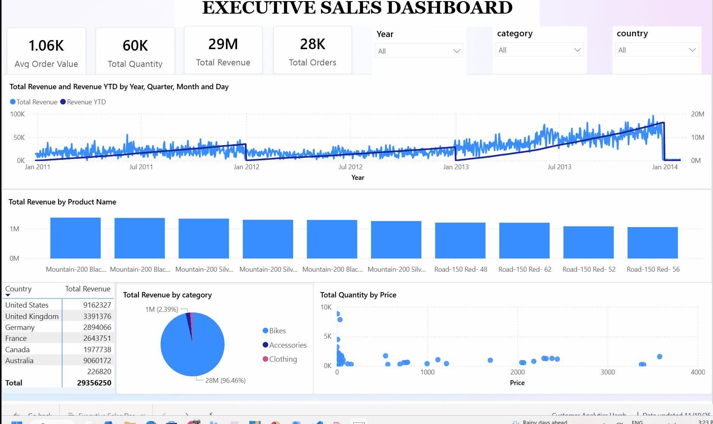

<!-- PROJECT BANNER -->
<p align="center">
  
  
  
</p>

<h1 align="center">📦 Data Warehouse Project (PostgreSQL + Medallion Architecture + PowerBI)</h1>

<p align="center">
End-to-end SQL-driven Data Warehouse using Bronze → Silver → Gold layers, with dimensional modelling and BI-ready outputs.
</p>

<h2 align="center">🎥 Dashboard Demo</h2>

<p align="center">
  
</p>
---

# 📑 Table of Contents
- [Overview](#overview)
- [Medallion Architecture](#medallion-architecture)
- [Star Schema Model](#star-schema-model)
- [Bronze Layer](#bronze-layer--raw-ingestion)
- [Silver Layer](#silver-layer--cleansing--standardisation)
- [Gold Layer](#gold-layer--dimensional-modelling)
- [Key SQL Techniques](#🧠-key-sql-techniques-used)
- [Final Outputs](#📊-final-output)

---

# Overview

This project demonstrates an **end-to-end Data Warehouse** built in **PostgreSQL** using the **Medallion Architecture (Bronze → Silver → Gold)**.

It integrates:
- CRM Data  
- ERP Product & Category Data  
- ERP Customer & Location Data  
- Sales Transactions  

Outputs include clean **fact & dimension views** used for **Power BI analytics**.

---

# Medallion Architecture
        ┌────────────────────────┐
        │        BRONZE          │
        │ Raw ingestion from CSV │
        └──────────┬─────────────┘
                   |
                   ▼
        ┌────────────────────────┐
        │         SILVER         │
        │ Cleaning, Standardise  │
        │ Dedup, Transform       │
        └──────────┬─────────────┘
                   |
                   ▼
        ┌────────────────────────┐
        │          GOLD          │
        │ Star Schema - Fact     │
        │ & Dimension Views      │
        └────────────────────────┘

---

# 🔹 Bronze Layer – Raw Ingestion

- Created `bronze` schema for CRM + ERP raw tables
- Loaded data using PostgreSQL `COPY ... FROM`  
- Used `TRUNCATE` for repeatable ingestion  
- Maintained raw audit columns (load timestamp, file lineage)

---

# 🔸 Silver Layer – Cleansing & Standardisation

Applied detailed cleaning, transformation, and standardisation:

- Cleaned text attributes using:
  - `TRIM()`
  - `UPPER()`
  - `COALESCE()`
- Applied business logic with:
  - `CASE WHEN`  
- Removed duplicates using window functions:
  - `ROW_NUMBER() OVER(PARTITION BY …)`
  - `RANK()`
- Standardised dates, IDs, and formats  
- Merged CRM + ERP attributes for enrichment  

---

# 🟡 Gold Layer – Dimensional Modelling

Built analytics-ready Star Schema:

### Dimensions:
- **`gold.dim_customers`**
  - CRM base + ERP attributes  
  - Cleaned, deduped customer records  

- **`gold.dim_products`**
  - CRM products + ERP category hierarchy  

### Fact Table:
- **`gold.fact_sales`**
  - Order number  
  - Product key  
  - Customer key  
  - Dates (order, ship, due)  
  - Quantity, price, sales amount  

Used these to generate BI-ready insights for:
- Sales performance  
- Product analytics  
- Customer segmentation  
- Category profitability  

---

# 🧠 Key SQL Techniques Used

### **Data Definition & Structuring**
- `CREATE SCHEMA`, `CREATE TABLE`, `DROP TABLE`, `CREATE VIEW`
- Implemented layered BW architecture (Bronze → Silver → Gold)

### **Data Ingestion**
- PostgreSQL `COPY ... FROM 'file.csv' CSV HEADER`
- Bulk loading + controlled refresh

### **Data Cleaning**
- `TRIM()`, `UPPER()`, `COALESCE()`  
- Robust `CASE WHEN` business rules  

### **Window Functions**
- `ROW_NUMBER()` for latest-record extraction  
- `RANK()` for dedupe and SCD-like logic  

### **Joins & Modelling**
- `LEFT JOIN` for dimension enrichment  
- CRM + ERP merged view strategies  
- Fact/dimension separation  

### **Data Quality Validation**
- Duplicate checks:
  ```sql
  GROUP BY id
  HAVING COUNT(*) > 1;
# 📊 Power BI Dashboard: Sales, Product & Customer Analytics

This project includes a fully interactive **Power BI dashboard** built on top of the Gold layer of the PostgreSQL data warehouse.  
The dashboard transforms the cleaned fact & dimension views into powerful business insights across sales, customers, and products.

---

## 🎯 Dashboard Objectives

- Provide a consolidated view of **sales performance**
- Analyse **customer behaviour & lifetime value**
- Identify **top-selling products**, categories & subcategories
- Track **daily, monthly and YTD revenue trends**
- Support strategic decisions through drill-down analytics

---

## 🧩 Dashboard Pages Included

### **1️⃣ Sales Overview**
- Total Revenue  
- Total Quantity Sold  
- Daily & Monthly Revenue Trends  
- Top 10 Products by Sales  
- Top 5 Categories  
- Revenue by Country / State  

---

### **2️⃣ Product Performance**
- Product-level revenue contribution  
- Category & Subcategory breakdown  
- Price–Demand scatter visual  
- High-selling & low-selling SKUs  

---

### **3️⃣ Customer Analytics**
- New vs Returning Customers  
- Customer Lifetime Value (CLV)  
- Repeat Purchase Behaviour  
- Customer Segmentation by:
  - Region  
  - Marital Status  
  - Gender   

---

### **5️⃣ Drill-Through Pages**
- Customer Profile Deep Dive  
- Product Detail Deep Dive  
- Sales Transaction View  

---

## 🛠️ Data Sources (From Gold Layer)

The dashboard is connected to the Gold schema, including:

- `gold.fact_sales`
- `gold.dim_customers`
- `gold.dim_products`

This ensures **clean, conformed, analytics-ready data** with no transformation inside Power BI — adhering to BI best practices.

---

## 🚀 Key Power BI Features Used

- **DAX measures** for revenue, quantity, and CLV  
- **Star Schema modelling** inside Power BI  
- **Tooltip pages** for deep insights  
- **Bookmarks & Button Navigation** for user-friendly experience  
- **Custom Themes** for consistent UI  
- **Scatter, TreeMap, Cards, Line & Column visuals**  

---


